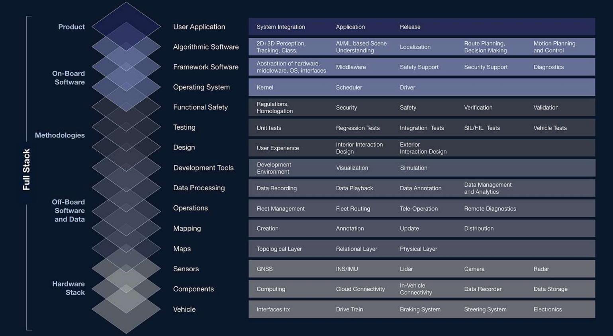
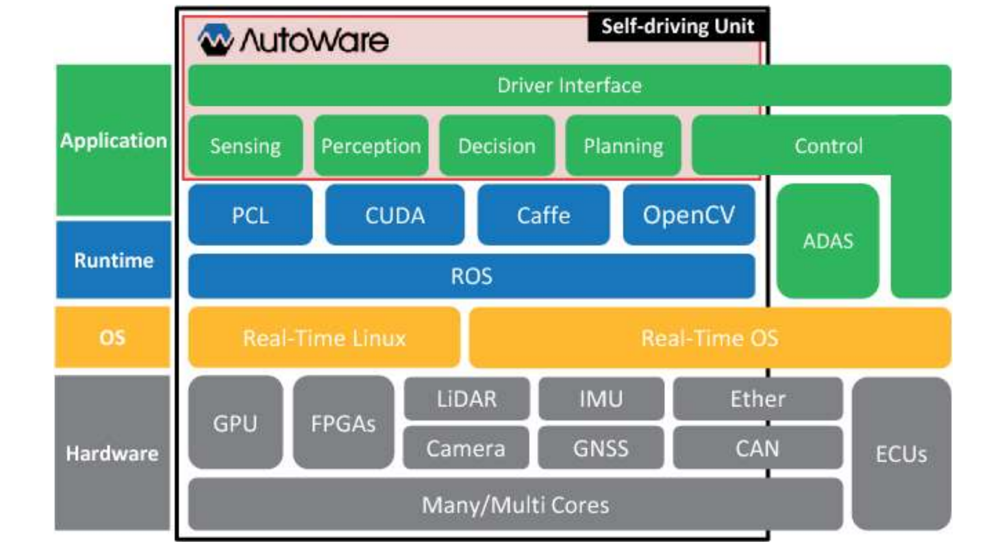
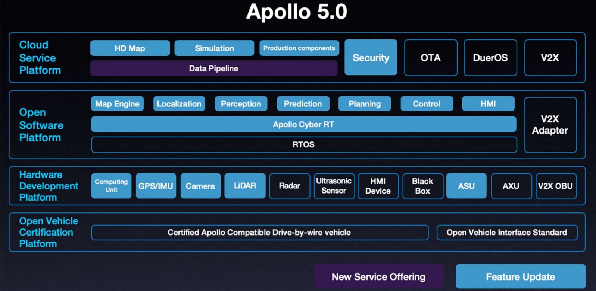

# Lecture 05: Autonomous Driving Stack

This lecture is provided by [Daniel Watzenig](https://www.linkedin.com/in/daniel-watzenig-4a0b985) and by [Markus Schratter](https://www.linkedin.com/in/markusschratter), from Autonomous Stuff. The lecture is available in YouTube:

The lecture will go through the motivation to use Autonomous Driving (AD) Stacks, the architecture of the AD stack based on Autoware, other AD stacks, how to integrate Autoware in research vehicles and an Autoware use case. In general, a view of the AD stacks will be provided. i.e. the required building blocks to create a self-driving car product that is safe to sell. The main concepts of the lecture will be:

- What are the AD stacks.
- Why they are necessary.
- How to use the Autoware-provided AD stack.

The provided PDFs can be found in the Apex.AI's [autowareclass2020 repository](https://gitlab.com/ApexAI/autowareclass2020/-/blob/master/lectures/05_Architectures), in GitLab. There is one for the [first](https://gitlab.com/ApexAI/autowareclass2020/-/blob/master/lectures/05_Architectures/Part_1.pdf), [second](https://gitlab.com/ApexAI/autowareclass2020/-/blob/master/lectures/05_Architectures/Part_2.pdf) and [third](https://gitlab.com/ApexAI/autowareclass2020/-/blob/master/lectures/05_Architectures/Part_3.pdf) parts of the lecture. The first part will go through AD stacks, the second will be about why and how to integrate Autoware in a research vehile and the third will analyze an Autoware use case.

---

## First part
## [5.1. Autonomous Driving Stacks](https://youtu.be/nTI4fnn2tuU?t=45)
During this first part, the hihg level architecture of Autonomous Vehicles (AVs) will be introduced, as well as the signal flow and timing requirements. The control layer will be seen on more depth, as well as the difference between concepts such as *safety critical*, *mission critical*, *load critical* and *mixed critical* systems.

### 5.1.1. Architecture of AD Stack
The AD stack consist in several layers that can be grouped in the *sub-stacks* represented by the following picture (extracted from the official lecture resources):

Focusing in a higher-level Autonomous Vehicle (AV) architecture and needs, a lot of **unpredictable conditions** will be faced (accidents, extreme weather conditions, humans or animals appearing in the road, etc.). They make it necessary to **fuse data** from a lot of sensors (RADARs, LIDARs, cameras, infrarred, ultrasonic, etc.) aund use a reliable sensor data processing and fusion to deliver a consistent model of the environment. This will allow the system to **plan safe actions** given the current conditions planning high-level behaviors as well as which trajectories and maneuvers are needed to actually execute them. Finally, a **low-level control** of the actuators is needed to perform all the necessary individual actions (braking, steering, throttle, etc.) to follow the planned trajectory. An additional module to all this is the **system performance and driver monitoring**, which will also provide valuable information, specially to prevent fatal failures or, at least, make their consequences less severe.

### [5.1.2. Signal Flow and Block Interaction](https://youtu.be/nTI4fnn2tuU?t=485)
Assuming as the basic blocks or layer the sensors, the perception, the planning and the control, the signal high-level interaction between them will be the perception one using the data from the sensors to perform detection, classification and tracking of relavant objects or spaces, as well as to localize the car, which will be done using the map aswell. All the generated information (where are the lanes, traffic signs, objects in the road and close to it, etc.)) is forwarded to the planning block, which will have planned (*long-term*) route, will predict the behavior of the other detected objects, plan the behavior that the ego-car should have and generate a trajectory that implements that behavior safely. Finally, the control layer will control the actuators to perform this trajectory.

### [5.1.3. Control Layer and AD Stack Task Decomposition](https://youtu.be/nTI4fnn2tuU?t=645)
The **control layer** perform different tasks that can be divided in the following **levels**:
- **Strategic/Mission Level**: The highest level task, consisting in route planning. The vehicle must follow existing roads and comply with the driving laws. It is allowed to take more than 10 seconds for it to do its job.
- **Tactical level**: It is in charge of maneuverin the vehicle in traffic. i.e. following a lane, mergin into a different one, execute the responses to the events that come up, etc. These tasks may have deadlines going from 1 second up to 10.
- **Reactive/Operational Level**: The control level with the shortest deadlines. It is in charge of controlling the the lateral and logitudinal adjustments of the vehicle's position in time frames going from 0.01 seconds up to 0.1.
- **Active Safety**: It runs in parallel and is in charge of reacting to threats. Some of the functions it may implement are the automated emergency braking or emergency maneuvers. Its actions can take from 0.1 seconds to 15.

The components of the AD stack in general can be assigned one of the following **levels of criticality**:

- **Safety-critical**: The highest and most important criticality level. When a safety-critical application or system fails, its consequence could be damage or death of the passengers. An example would be the controller of the steering angle. Safety-critical parts of the system must run in hard Real Time (RT).
- **Mission-critical**: They have a high priority, but their failure will not harm humans. A failure in it, will mean that the mission will not succeed. An example is the navigation system. If it does not work, the passengers will not reach their destination. It should work in soft RT.
- **Low-critical**: Tasks that do not affect the mission or safety, but affect the user experience.

A system integrating components with different levels of criticality in the same hardware platfom is known as a  **Mixed Criticality Systems** (MCS). AVs or UAVs are usually examples of this type of systems.

### [5.1.4. Autoware](https://youtu.be/nTI4fnn2tuU?t=950)
So far, the discuted topics were the motivation of AD stacks, the layers composing the full stack (HW layer, off-board layer, on-board layer and methods and tools implementing the stack),  the high-level architecture of an AV and the signal flow withing the building blocks of it (sense, plan and act), the layers within the control block (strategic, tactical and reactive) and the levels of criticality (safety, mission and low critical apps and systems). Next, the Autoware AD stack will be introduced, as well as its abstraction layers and the differences between Autoware.AI and Autoware.Auto.

Autoware was started in 2015 by Shinpei Kato at Nagoya University as an open-source software for AD. The Autoware Foundation was created in 2018, which is a non-profit organization supporting Autoware, composed by many partners from the industry, government and academic ambits.

#### [5.1.4.1. Autoware.AI](https://youtu.be/nTI4fnn2tuU?t=1095)
It was the first project and it was based on ROS 1. It is under the Apache 2.0 license and contains the following modules:

- **Localization** using 3D maps and SLAM algorithms combined with GNSS and Inertial Movement Units (IMUs).
- **Detection** using cameras and LiDARs, sensor fusion and Deep Neural Networks (DNNs).
- **Prediction and planning** based on rule-based probabilistic system, with some DNNs as well.

Autoware's output was a *twist* message, contanining linear and angular velocities.

Regarding its **abstraction layers**, in Autoware.AI they are:

- **Hardware layer**: It includes the sensors and communication and computational resources, as listed in the image below (extracted from the official course materials).
- **OS layer**: Running just on top of the hardware. It is distinguished between RT Linux and RTOS.
- **Runtime layer**: All the runtime dependencies of the applications above the OS, such as libraries and *meta-systems* (as ROS).
- **Application layer**: The actual modules implemented using all the layers below this one. The driver interface will be on top of all the other applications. 

#### [5.1.4.1. Autoware.Auto](https://youtu.be/nTI4fnn2tuU?t=1380)
As exposed before in the lecture, hard RT functionalities are required for some parts of the stack. This is the main reason of the evolution of the project towards Autoware.Auto, which uses ROS 2, being this the main difference between these two Autoware versions. Moreover, Autoware.Auto is more modular and its development uses state-of-the-art certifiable development process based on Continous Integration (CI) and Continuous Development (CD), for which the pull requests are reviewed, built and tested, the documentation is comprehensive, 100% of the code is tested, there is a coding guide and is managed by an open source community manager. Further details can be found the provided [Contributor's guide](https://autowarefoundation.gitlab.io/autoware.auto/AutowareAuto/contributors-guide.html).

The **Autoware.Auto development process** is based in Operational Design Domain (ODD), which consists in a series of limitations to the application where the vehicle will be used that are being enlarged whenever the behavior is successful with the current constraints, making them less and less restrictives. Some example constraints could be only day driving, low speeds, absence of other cars, absence of unpredicted events, etc.

#### [5.1.4.3. Commercial use of Autoware](https://youtu.be/nTI4fnn2tuU?t=1735)
Apex.AI is working to achieve the commercial usage of Autoware building on top of Autoware.Auto, developing *Apex.OS*, which improves the code quality, hard RT, safety, documentation, support for automotive ECUs and sensors, certifications (ISO 26262, SEooC, ASIL-D), customer support, etc.

### [5.1.5. Other AD Stacks](https://youtu.be/nTI4fnn2tuU?t=1860)
Appart of the Autoware AD stack, the most popular ones in June 2020 are:

- DriveWorks, by Nvidia.
- Apollo, by Apollo.
- EB Robinos and EB Robinos Predictor, by Elektrobit.

#### [5.1.5.1. Nvidia DriveWorks](https://youtu.be/nTI4fnn2tuU?t=1965)
The main difference with Autoware is that the Nvidia stack is not open-source. It is composed by the following blocks:

- **Drive AV**: Planning, mapping and perception.
- **Drive IX**: Visualization, AI CoPilot and AI Assistant. It is sharing the top of the stack with the Drive AV.
- **DriveWorks**: Supports networks, calibration (link to the vehicle) and core (bottom layer, receiving the sensors inputs, vehicle I/O, etc.).
- **Drive OS**: Lowest level of the stack.
- Supported **hardware** platforms: Nvidia supports the Drive AGX Developer Kits (Xavier/Pegasus) and the Drive Hyperion Developer Kit. Pegasus is currently the best option.

Further details can be found in [Nvidia web](https://developer.nvidia.com/drive/drive-software).

Nvidia offers the **DRIVE Constellation Simulator and the DRIVE Constellation Vehicle**.

The first one uses the so called software world, which is a world with a simulated environment and models for the traffic, the ego vehicle, the sensors and the scenarios. All of this is integrated in the DRIVE Sim API, which runs on top of the DRIVE Sim, which will be running on the DRIVE Constellation OS, using the DRIVE Constellation Simulator as its hardware.

Regarding the DRIVE Constellation Vehicle, it is used when the design, implementation, optimization and testing has already been performed in the Simulator. On top of the hardware, the DRIVE OS is running, used to provide the DRIVE Core and DRIVE Networks. On top of it, as seen before, DRIVE AV and DRIVE IX will be running.

#### [5.1.5.2. Apollo](https://youtu.be/nTI4fnn2tuU?t=2255)
Launched in 2017 and improved since then with over 2-3 updates per year, being the next big update planned for 2021. AVs driven by Apollo are allowed to drive in certain places in public japanese roads. It has a lot of partners/supporters.

The Apollo modules are quite similar to both the Autoware and Nvidia ones, being the following:

- Data pipeline
- Perception
- Planning
- Control
- Prediction
- Map engine
- Simulation

The current Apollo 5.0 supports four layers: Open Vehicle Certification Platform, Hardware Development Platform, Open Software Platform and Cloud Service Platform, being each of them composed by the elements shown in this image, extracted from the official course materials:

---

## Second part
## [5.2. Integration of Autoware.AI in a Research Vehicle](https://youtu.be/nTI4fnn2tuU?t=2465)
### 5.2.1. What is Needed?
### 5.2.2. Hardware and Integration Overview
### 5.2.3. Providing AD Functionality for Research Projects

---

## Third part
## 5.3. Use Case: Roborace
- Using Autoware components
